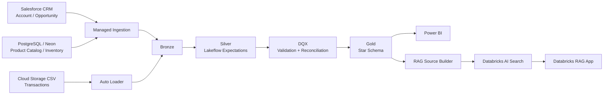
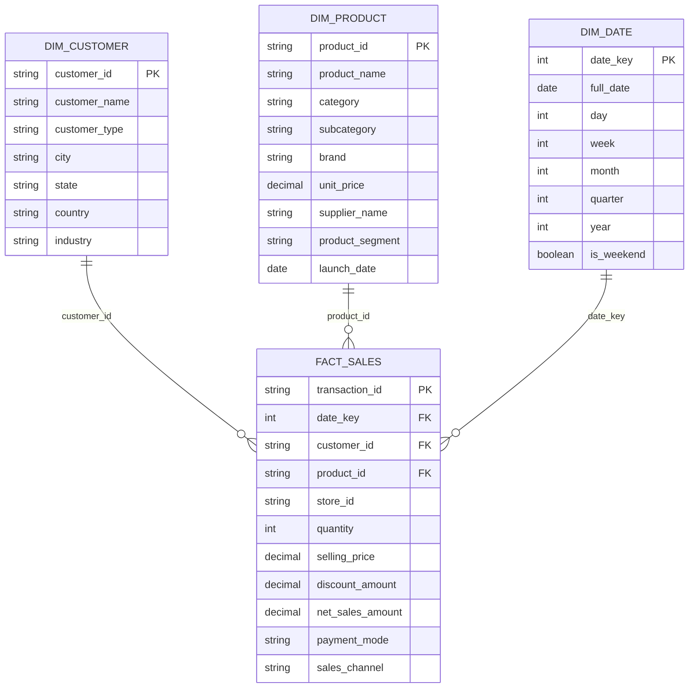
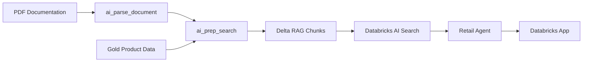

# Retail Data Platform
 
A production-style retail analytics and AI platform built on Databricks and Azure. It covers the full path from source ingestion to governed analytics, data quality checks, CI/CD, Power BI reporting, and a grounded RAG application.
 
The project has separate DEV and PROD environments. Deployment is automated with GitHub Actions and Databricks Asset Bundles.
 
## Table of Contents
 
- [Project Overview](#project-overview)
- [Business Problem](#business-problem)
- [Architecture](#architecture)
- [Data Sources](#data-sources)
- [Medallion Architecture](#medallion-architecture)
- [Gold Data Model](#gold-data-model)
- [Data Quality](#data-quality)
- [Testing Strategy](#testing-strategy)
- [Analytics with Power BI](#analytics-with-power-bi)
- [RAG Application](#rag-application)
- [Governance and Security](#governance-and-security)
- [CI/CD and Deployment](#cicd-and-deployment)
- [Advanced Capability](#advanced-capability)
- [Repository Structure](#repository-structure)
- [Local Development](#local-development)
- [Deployment](#deployment)
- [Design Decisions](#design-decisions)
- [Cost and Performance Trade-offs](#cost-and-performance-trade-offs)
- [AI-Assisted Development and Guardrails](#ai-assisted-development-and-guardrails)
- [Demo Flow](#demo-flow)
- [Key Outcomes](#key-outcomes)
## Project Overview
 
Retail companies usually work with different systems: CRM platforms, operational databases, transaction files, and analytics tools. This project brings all of them into one governed data platform.
 
Main parts of the solution:
 
- batch and incremental ingestion from multiple sources
- Bronze, Silver, and Gold layers
- Lakeflow Declarative Pipelines
- orchestration with Databricks Jobs
- row-level data validation and quarantine
- reconciliation before Gold processing
- automated unit and integration tests
- Unity Catalog governance
- Power BI analytics
- a Databricks RAG application backed by AI Search
- DEV-to-PROD deployment through CI/CD
The result is a platform where the same code and Asset Bundle configuration move across environments, without recreating production resources by hand.
 
## Business Problem
 
The project solves four common retail data problems:
 
**Disconnected source systems**
Customer, opportunity, inventory, product, and transaction data come from different platforms.
 
**Different ingestion patterns**
SaaS apps, relational databases, and cloud storage files each need a different ingestion approach.
 
**Data quality risk**
Invalid records need to be found and isolated, without silently breaking the curated models.
 
**Different consumption needs**
Business users need visual dashboards. Other users need natural-language access to platform knowledge and product data.
 
## Architecture
 

 
Cross-cutting platform capabilities:
 
- **Orchestration:** Databricks Jobs
- **Storage:** Delta Lake
- **Governance:** Unity Catalog
- **Security:** RLS/CLS and Azure Key Vault-backed secrets
- **Deployment:** Databricks Asset Bundles
- **CI/CD:** GitHub Actions
- **Observability:** pipeline execution history, test results, and MLflow tracing for the AI application
## Data Sources
 
| Source | Data | Ingestion Pattern |
|---|---|---|
| Salesforce CRM | Account, Opportunity | Managed incremental ingestion |
| PostgreSQL / Neon | Product Catalog, Inventory | Managed database ingestion |
| Cloud Storage | Transaction CSV files | Auto Loader |
| Unity Catalog Volume | Platform PDF documentation | RAG document ingestion |
 
New transaction files can arrive at any time. Auto Loader picks up only the new files, so the full history never needs to be reloaded.
 
## Medallion Architecture
 
### Bronze
 
The Bronze layer keeps the source data close to its original form, with minimal changes.
 
What it does:
 
- keeps source fidelity
- works as an auditable landing layer
- supports replay and reprocessing
- keeps ingestion logic separate from business logic
### Silver
 
The Silver layer cleans and validates the source data.
 
Typical transformations:
 
- ID normalization
- text cleanup
- type conversion
- timestamp parsing
- handling missing values
- derived attributes
- product segmentation
- business-rule validation
Lakeflow Expectations run at this stage to catch invalid records as early as possible.
 
Current Silver quality coverage:
 
| Dataset | Expectations |
|---|---|
| Transactions | 9 |
| Inventory | 7 |
| Product Catalog | 6 |
| Account | 4 |
| Opportunity | 5 |
 
### Gold
 
The Gold layer holds business-ready models.
 
The main model is a retail star schema built around `fact_sales`.
 
Gold feeds:
 
- Power BI
- data quality integration tests
- the RAG source builder, for curated product context
## Gold Data Model
 

 
**Fact table grain:** `fact_sales` has one row per retail transaction. It joins transaction data with customer and product relationships, and exposes the measures the analytics layer needs.
 
## Data Quality
 
Data quality is a multi-stage control, not a single validation step.
 
```
Silver
  │
  ├── Lakeflow Expectations
  │
  ▼
DQX processing
  ├── Valid records
  └── Quarantined records
          │
          ▼
Reconciliation
total Silver records = valid records + quarantined records
          │
          ▼
Gold
          │
          ▼
Gold quality tests
```
 
### Quarantine strategy
 
Invalid records are isolated instead of failing the whole workflow.
 
This distinction matters:
 
- row-level failure → the record goes to quarantine
- pipeline-level failure → downstream processing stops
Quarantined data does not block Gold on its own. Gold continues when DQ succeeds and reconciliation proves no records were lost.
 
### Reconciliation rule
 
```
total = valid + quarantined
```
 
If reconciliation fails, the workflow fails before Gold can run.
 
### Gold validation
 
Gold quality checks cover:
 
- non-null business keys
- uniqueness
- referential integrity between `fact_sales` and the dimensions
- expected model consistency
## Testing Strategy
 
The test suite has two layers.
 
### Unit Tests
 
Unit tests check transformation logic on its own.
 
Coverage includes transformations for:
 
- transactions
- product catalog
- `fact_sales`
Run locally:
 
```bash
uv run --only-group unit pytest tests/unit -m unit
```
 
### Integration Tests
 
Integration tests check the deployed DEV platform after the pipeline runs.
 
Current coverage:
 
- DQX reconciliation
- Gold data quality validation
Example: `test_dqx_reconciliation` checks that
 
```
total Silver records = valid records + quarantined records
```
 
Integration tests run in CI only after the DEV data workflow succeeds.
 
## Analytics with Power BI
 
The Gold layer feeds Power BI directly.
 
The dashboard answers questions like:
 
- How are sales changing over time?
- Which product categories contribute most to sales?
- Which products perform best?
- How do suppliers compare?
- What is the customer segment mix?
- Which sales channels contribute most?
Power BI is the main business-facing layer. The RAG application does not duplicate this analytical logic.
 
## RAG Application
 
The project includes a grounded retail assistant, deployed as a Databricks App.
 
The RAG knowledge base combines:
 
- curated platform documentation, stored as PDFs in a Unity Catalog Volume
- structured product information from Gold
- aggregated product sales metrics
### RAG pipeline
 

 
### RAG source table
 
The prepared search table includes fields such as:
 
- `chunk_id`
- `chunk_position`
- `chunk_to_retrieve`
- `chunk_to_embed`
- `metadata`
- `source_uri`
- `document_type`
- `product_id`
- `category`
- `product_segment`
### AI Search
 
- **Index type:** Delta Sync
- **Sync mode:** Triggered
- **Embedding model:** `databricks-qwen3-embedding-0-6b`
CI/CD triggers the AI Search sync and waits for the pipeline update to finish before it deploys or restarts the app.
 
### Foundation model
 
`databricks-qwen3-next-80b-a3b-instruct`
 
### Application behavior
 
The assistant is instructed to:
 
- retrieve project context for factual platform questions
- answer only from retrieved content
- avoid inventing missing facts
- avoid adding currencies unless they appear in the context
- avoid unsupported rankings or comparisons
- distinguish quarantined rows from pipeline failures
- distinguish pre-Gold validation from Gold-model validation
MLflow tracing is on for agent execution and observability.
 
## Governance and Security
 
Governance is based on Unity Catalog.
 
The platform uses dedicated schemas for:
 
- Silver
- Gold
- Quarantine
- AI/RAG
- Volumes
Security controls:
 
- Unity Catalog privileges
- row-level security where needed
- column-level security where needed
- Azure Key Vault-backed secret management
- environment-scoped CI/CD credentials
- service-principal authentication for production automation
No application or source credential is stored in the repository.
 
## CI/CD and Deployment
 
The platform deploys through GitHub Actions and Databricks Asset Bundles, as a sequence of quality gates.

```mermaid
flowchart LR
    PR[Pull Request / Main]
    VAL[Validate + Unit Tests]
    DEV[Deploy DEV]
    WF[Run Retail Workflow]
    INT[Integration Tests]
    RAG[Build RAG Source]
    SYNC[AI Search Sync]
    APP[Deploy RAG App]
    PROD[Deploy PROD]
 
    PR --> VAL
    VAL --> DEV
    DEV --> WF
    WF --> INT
    INT --> RAG
    RAG --> SYNC
    SYNC --> APP
    APP --> PROD
```
 

 
### Reusable GitHub Actions workflows
 
The CI/CD setup is split into reusable workflow files, instead of one large YAML file:
 
```
cicd.yml
   │
   ├── validate.yml
   │     ├── install dependencies
   │     ├── unit tests
   │     └── bundle validation
   │
   ├── deploy-dev.yml
   │     ├── bundle deployment
   │     └── retail workflow execution
   │
   ├── integration-tests.yml
   │     └── deployed-platform tests
   │
   └── rag-dev.yml
         ├── build RAG source
         ├── trigger AI Search sync
         ├── wait for sync completion
         └── deploy/restart the RAG application
```
 
Production deployment uses a dedicated paid workspace, with automated authentication through a service principal / workload identity flow.
 
### Deployment principles
 
- nothing is created manually in PROD
- infrastructure and Databricks resources are version-controlled
- the same bundle is promoted across environments
- tests gate the deployment
- production changes are reproducible
## Advanced Capability
 
The project uses managed incremental ingestion for external operational sources, combined with file-based incremental processing through Auto Loader.
 
This shows how one Lakehouse platform can ingest:
 
- SaaS CRM data
- operational relational data
- incremental transaction files
while still converging on the same Bronze → Silver → Gold architecture.
 
## Repository Structure
 
```
retail_project-1/
│
├── .github/
│   └── workflows/
│       ├── cicd.yml
│       ├── validate.yml
│       ├── deploy-dev.yml
│       ├── integration-tests.yml
│       └── rag-dev.yml
│
├── app/
│   └── retail_rag_assistant/
│       ├── agent_server/
│       ├── tests/
│       ├── app.yaml
│       ├── pyproject.toml
│       └── manifest.yaml
│
├── notebooks/
│   └── ...
│
├── resources/
│   ├── pipelines and jobs
│   ├── RAG build resources
│   ├── AI Search resources
│   ├── MLflow experiment
│   └── Databricks App resource
│
├── src/
│   ├── quality/
│   │   └── run_dqx.py
│   │
│   └── rag/
│       ├── product_documents.py
│       ├── pdf_documents.py
│       ├── search_documents.py
│       └── build_rag_source.py
│
├── tests/
│   ├── unit/
│   └── integration/
│
├── databricks.yml
├── pyproject.toml
├── uv.lock
└── README.md
```
 
## Local Development
 
### Prerequisites
 
- Python 3.12+
- uv
- Databricks CLI
- access to the Databricks DEV workspace
- valid environment credentials
### Install dependencies
 
```bash
uv sync --frozen
```
 
### Run unit tests
 
```bash
uv run --only-group unit pytest tests/unit -m unit
```
 
### Run integration tests
 
Integration tests need the deployed DEV environment:
 
```bash
uv run pytest tests/integration -m integration
```
 
### Validate the Asset Bundle
 
```bash
databricks bundle validate -t dev
```
 
## Deployment
 
### DEV
 
Validate:
 
```bash
databricks bundle validate -t dev
```
 
Deploy:
 
```bash
databricks bundle deploy -t dev
```
 
Run the end-to-end data workflow:
 
```bash
databricks bundle run retail_workflow -t dev
```
 
Build the RAG source:
 
```bash
databricks bundle run rag_build_source -t dev
```
 
Deploy or restart the RAG application:
 
```bash
databricks bundle run retail_rag_assistant -t dev
```
 
### PROD
 
Production follows the same bundle-driven approach:
 
```bash
databricks bundle validate -t prod
databricks bundle deploy -t prod
```
 
Production deployment runs through CI/CD, not manually from a developer machine.
 
## Design Decisions
 
**Lakeflow Declarative Pipelines**
Lakeflow handles the core transformation pipelines, instead of orchestrating every Spark dependency by hand. Benefits: declarative dependencies, simpler pipeline management, built-in expectations, better visibility, easier reruns.
 
**DQX after Silver**
DQX sits between Silver and Gold as an explicit quality gate. This lets row-level problems go to quarantine while good data keeps moving.
 
**Star schema for Gold**
Gold uses a dimensional model because the main consumers are analytical workloads. This keeps Power BI relationships simple, business measures easy to understand, and referential-integrity testing explicit.
 
**Power BI for exact analytics**
Power BI owns analytical reporting and exact business metrics. The RAG application does not replace it.
 
**RAG combines documentation and curated data**
The RAG assistant mixes unstructured documentation with curated product data. This gives users natural-language access to platform knowledge, while keeping answers grounded in controlled sources.
 
**Triggered AI Search sync**
AI Search uses triggered sync instead of continuous refresh. CI/CD rebuilds the RAG source first, then syncs the index. This makes deployments predictable and keeps costs down.
 
**No dbt layer**
A separate dbt layer was left out on purpose. Lakeflow, PySpark transformations, Gold dimensional modeling, DQX, Expectations, and Power BI already cover the transformation and analytics needs.
 
## Cost and Performance Trade-offs
 
**Serverless compute**
Lowers infrastructure management and fits an academic/portfolio platform with a variable workload. Trade-off: less low-level cluster tuning, in exchange for simpler operations.
 
**Triggered AI Search**
The vector index refreshes only after the RAG source rebuilds successfully. Benefit: predictable freshness and lower refresh cost.
 
**Curated Gold models**
Business-ready Gold models avoid running complex joins repeatedly in downstream tools. Trade-off: more compute during refresh, in exchange for simpler and faster consumption.
 
**Quarantine instead of hard rejection**
Invalid records are isolated instead of stopping the platform. Benefit: good data keeps moving while bad data stays auditable.
 
**DEV / PROD separation**
Separate workspaces, with matching naming across environments. Benefit: strong environment isolation with little configuration drift.
 
## AI-Assisted Development and Guardrails
 
AI tools helped speed up parts of the work, including:
 
- code review
- troubleshooting
- documentation
- test design
- architecture discussion
- refactoring suggestions
AI suggestions were not treated as automatically correct. Guardrails included:
 
- checking behavior with unit tests
- checking platform behavior with integration tests
- reviewing deployment plans before applying changes
- checking generated Databricks configuration against real workspace behavior
- verifying RAG outputs against source data
- keeping the application prompt limited to retrieved context
- blocking unsupported assumptions in AI responses
AI worked as an accelerator. Tests and platform execution stayed the source of truth.
 
## Demo Flow
 
Suggested order for the final demo:
 
1. Business problem and platform architecture
2. Source systems and ingestion
3. Bronze → Silver → DQX → Gold processing
4. Data quality quarantine and reconciliation
5. Gold star schema
6. Power BI analytics
7. RAG application
8. GitHub Actions CI/CD
9. DEV → PROD automated deployment
10. Q&A
The goal is to show one integrated platform with automated quality gates and reproducible deployment, not a set of isolated notebooks.
 
## Key Outcomes
 
This project shows practical experience with:
 
- Databricks and Azure
- Lakehouse architecture
- batch and incremental ingestion
- Auto Loader
- Lakeflow Declarative Pipelines
- Databricks Jobs
- Delta Lake
- Unity Catalog
- DQX
- automated data quality controls
- PySpark
- unit and integration testing
- Databricks Asset Bundles
- GitHub Actions
- DEV / PROD deployment
- Power BI
- Databricks AI Search
- RAG
- Databricks Apps
- MLflow tracing
- production-oriented data platform design
## Author
 
Yanquiel Arango
 
Retail Data Platform — Databricks Academy Final Project
 
