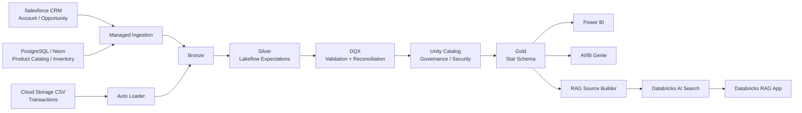
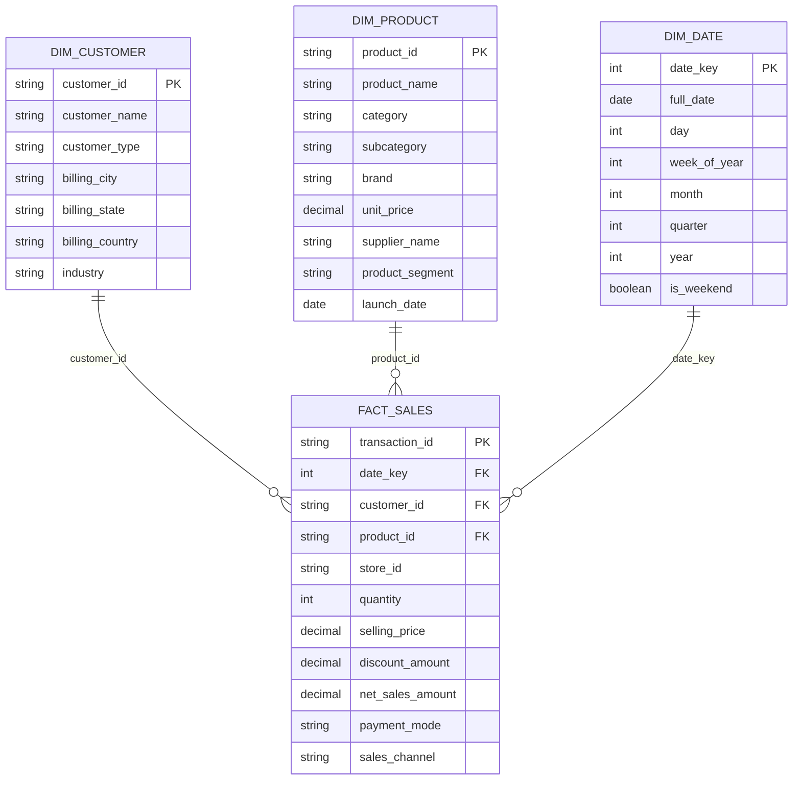
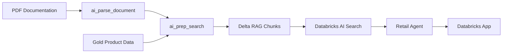
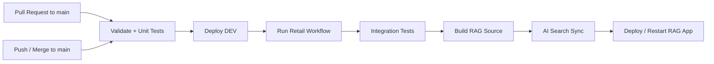
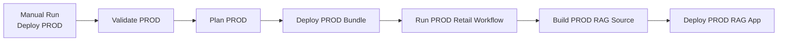

# Retail Data Platform

A production style retail analytics and AI platform built on Databricks and Azure. It covers the full path from source ingestion to governed analytics data quality checks CI/CD Power BI reporting AI/BI Genie and a grounded RAG application.

The project has separate DEV and PROD environments. Deployment is automated with GitHub Actions and Databricks Asset Bundles.

## Table of Contents

- [Project Overview](#project-overview)
- [Business Problem](#business-problem)
- [Architecture](#architecture)
- [Data Sources](#data-sources)
- [Medallion Architecture](#medallion-architecture)
- [Gold Data Model](#gold-data-model)
- [Data Quality](#data-quality)
- [Testing Strategy](#testing-strategy)
- [Analytics with Power BI](#analytics-with-power-bi)
- [AI/BI Genie](#aibi-genie)
- [RAG Application](#rag-application)
- [Governance and Security](#governance-and-security)
- [CI/CD and Deployment](#cicd-and-deployment)
- [Advanced Capability](#advanced-capability)
- [Repository Structure](#repository-structure)
- [Local Development](#local-development)
- [Deployment](#deployment)
- [Design Decisions](#design-decisions)
- [Cost and Performance Trade-offs](#cost-and-performance-trade-offs)
- [AI-Assisted Development and Guardrails](#ai-assisted-development-and-guardrails)
- [Demo Flow](#demo-flow)
- [Key Outcomes](#key-outcomes)

## Project Overview

Retail companies usually work with different systems such as CRM platforms operational databases transaction files and analytics tools. This project brings all of them into one governed data platform.

Main parts of the solution:

- batch and incremental ingestion from multiple sources
- Bronze Silver and Gold layers
- Lakeflow Declarative Pipelines
- orchestration with Databricks Jobs
- row level data validation and quarantine
- reconciliation before Gold processing
- automated unit and integration tests
- Unity Catalog governance
- Power BI analytics
- AI/BI Genie for natural language analytics over the Gold star schema
- a Databricks RAG application backed by AI Search
- DEV to PROD deployment through CI/CD

The result is a platform where data pipelines governance AI resources applications and Genie configuration can be promoted across environments through the same version controlled Databricks bundle.

## Business Problem

The project solves four common retail data problems:

**Disconnected source systems**

Customer opportunity inventory product and transaction data come from different platforms.

**Different ingestion patterns**

SaaS apps relational databases and cloud storage files each need a different ingestion approach.

**Data quality risk**

Invalid records need to be found and isolated without silently breaking the curated models.

**Different consumption needs**

Business users need visual dashboards natural language analytics and grounded access to platform knowledge and curated product information.

## Architecture



Cross cutting platform capabilities:

- **Orchestration:** Databricks Jobs
- **Storage:** Delta Lake
- **Governance:** Unity Catalog
- **Security:** RLS CLS and Azure Key Vault backed secrets
- **Deployment:** Databricks Asset Bundles
- **CI/CD:** GitHub Actions
- **Observability:** pipeline execution history test results and MLflow tracing for the AI application

## Data Sources

| Source | Data | Ingestion Pattern |
|---|---|---|
| Salesforce CRM | Account Opportunity | Managed incremental ingestion |
| PostgreSQL / Neon | Product Catalog Inventory | Managed CDC style database ingestion |
| Cloud Storage | Transaction CSV files | Auto Loader |
| Unity Catalog Volume | Platform PDF documentation | RAG document ingestion |

New transaction files can arrive at any time. Auto Loader picks up only the new files so the full history never needs to be reloaded.

### Schema Evolution and Re-runs

The ingestion and transformation layers are designed for incremental processing and safe re-runs. Auto Loader processes newly arriving transaction files without re-reading the full history while the Silver layer applies type conversion validation rules and expectations before data can reach Gold.

Schema related changes are handled at the ingestion and transformation layers. Unexpected or invalid data is isolated through quality controls instead of silently reaching business ready models.

The pipelines are designed to be idempotent and re-runnable so the same deployment can be executed again without duplicating business data.

## Medallion Architecture

### Bronze

The Bronze layer keeps the source data close to its original form with minimal changes.

What it does:

- keeps source fidelity
- works as an auditable landing layer
- supports replay and reprocessing
- keeps ingestion logic separate from business logic

### Silver

The Silver layer cleans and validates the source data.

Typical transformations:

- ID normalization
- text cleanup
- type conversion
- timestamp parsing
- handling missing values
- derived attributes
- product segmentation
- business rule validation

Lakeflow Expectations run at this stage to catch invalid records as early as possible.

Current Silver quality coverage:

| Dataset | Expectations |
|---|---:|
| Transactions | 9 |
| Inventory | 7 |
| Product Catalog | 6 |
| Account | 4 |
| Opportunity | 5 |

### Gold

The Gold layer holds business ready models.

The main model is a retail star schema built around `fact_sales`.

Gold feeds:

- Power BI
- AI/BI Genie
- data quality integration tests
- the RAG source builder for curated product context

## Gold Data Model



**Fact table grain:** `fact_sales` has one row per retail transaction. It joins transaction data with customer and product relationships and exposes the measures the analytics layer needs.

## Data Quality

Data quality is a multi stage control not a single validation step.

```text
Silver
  │
  ├── Lakeflow Expectations
  │
  ▼
DQX processing
  │
  ├── Valid records
  └── Quarantined records
          │
          ▼
Reconciliation
  │
  │ total Silver records = valid records + quarantined records
  │
  ▼
Governance / Security
  │
  ▼
Gold
  │
  ▼
Gold quality tests
```

### Quarantine strategy

Invalid records are isolated instead of failing the whole workflow.

This distinction matters:

- row level failure → the record goes to quarantine
- pipeline level failure → downstream processing stops

Quarantined data does not block Gold on its own. Gold continues when DQ succeeds and reconciliation proves no records were lost.

### Reconciliation rule

```text
total = valid + quarantined
```

If reconciliation fails the workflow fails before Gold can run.

### Gold validation

Gold quality checks cover:

- non null business keys
- uniqueness
- referential integrity between `fact_sales` and the dimensions
- expected model consistency

## Testing Strategy

The test suite has two layers.

### Unit Tests

Unit tests check transformation logic on its own.

Coverage includes transformations for:

- transactions
- product catalog
- `fact_sales`

Run locally:

```bash
uv run --only-group unit pytest tests/unit -m unit
```

### Integration Tests

Integration tests check the deployed DEV platform after the pipeline runs.

Current coverage:

- DQX reconciliation
- Gold data quality validation

Example `test_dqx_reconciliation` checks that:

```text
total Silver records = valid records + quarantined records
```

Integration tests run in CI only after the DEV data workflow succeeds.

## Analytics with Power BI

The Gold layer feeds Power BI directly.

The dashboard answers questions like:

- How are sales changing over time
- Which product categories contribute most to sales
- Which products perform best
- How do suppliers compare
- What is the customer segment mix
- Which sales channels contribute most

Power BI is the main visual analytics layer for dashboards and predefined business metrics.

AI/BI Genie complements Power BI by allowing users to ask natural language questions directly against the Gold star schema.

The RAG application serves a different purpose. It provides grounded access to platform documentation and curated product knowledge instead of replacing analytical reporting.

## AI/BI Genie

The platform includes an AI/BI Genie Space for natural language analytics over the Gold star schema.

Genie uses:

- `fact_sales` for sales and transaction metrics
- `dim_customer` for customer analysis
- `dim_product` for product analysis
- `dim_date` for date and time analysis

The Genie Space is configured with explicit business instructions reusable joins a sales measure and verified SQL examples.

### Configured relationships

The following star schema relationships are explicitly defined:

```text
fact_sales.customer_id = dim_customer.customer_id
fact_sales.product_id = dim_product.product_id
fact_sales.date_key = dim_date.date_key
```

These relationships are configured as many to one joins from the fact table to the dimensions.

### Business measure

The main sales measure is:

```sql
SUM(fact_sales.net_sales_amount)
```

The measure is used when users ask about:

- net sales
- total net sales
- sales
- sales amount
- revenue

### Verified example questions

Genie includes reviewed SQL examples for questions such as:

- What are the monthly total net sales
- Show the top 10 customers by net sales
- Show net sales by product category

For monthly sales analysis Genie uses `dim_date` and `month_year_sort` to keep results in chronological order.

### Business instructions

The Genie Space includes instructions that define:

- which tables should be used for each type of analysis
- net sales as the default sales metric
- chronological sorting for time trends
- descending sorting for Top N analysis
- use of Gold dimensions for customer product and time analysis
- avoidance of unsupported business assumptions

Genie is also instructed not to invent explanations for unusual values.

For example if a month has much lower sales than the others Genie can report the observed value but should not assume that the reason is missing data seasonality or a business disruption unless the source data supports that conclusion.

### DEV and PROD deployment

The Genie Space is managed as part of the Databricks Asset Bundle.

DEV and PROD use separate Genie Space instances and separate SQL Warehouses while sharing the same version controlled configuration.

```text
DEV
└── Retail Sales and Customer Analytics
    └── DEV SQL Warehouse

PROD
└── Retail Sales and Customer Analytics
    └── PROD SQL Warehouse
```

The bundle stores the Genie resource configuration in:

```text
resources/retail_sales_and_customer_analytics.genie_space.yml
```

and the serialized Genie configuration in:

```text
src/retail_sales_and_customer_analytics.geniespace.json
```

Changes to Genie instructions joins measures tables or example queries can therefore be promoted through the same deployment process as the rest of the platform.

## RAG Application

The project includes a grounded retail assistant deployed as a Databricks App.

The RAG knowledge base combines:

- curated platform documentation stored as PDFs in a Unity Catalog Volume
- structured product information from Gold
- aggregated product sales metrics

### RAG pipeline



### RAG source table

The prepared search table includes fields such as:

- `chunk_id`
- `chunk_position`
- `chunk_to_retrieve`
- `chunk_to_embed`
- `metadata`
- `source_uri`
- `document_type`
- `product_id`
- `category`
- `product_segment`

### AI Search

- **Index type:** Delta Sync
- **Sync mode:** Triggered
- **Embedding model:** `databricks-qwen3-embedding-0-6b`

CI/CD triggers the AI Search sync and waits for the pipeline update to finish before it deploys or restarts the app.

### Foundation model

`databricks-qwen3-next-80b-a3b-instruct`

### Application behavior

The assistant is instructed to:

- retrieve project context for factual platform questions
- answer only from retrieved content
- avoid inventing missing facts
- avoid adding currencies unless they appear in the context
- avoid unsupported rankings or comparisons
- distinguish quarantined rows from pipeline failures
- distinguish pre Gold validation from Gold model validation

MLflow tracing is on for agent execution and observability.

## Governance and Security

Governance is based on Unity Catalog.

The platform uses dedicated schemas for:

- Silver
- Gold
- Quarantine
- AI/RAG
- Volumes

Security controls:

- Unity Catalog privileges
- row level security where needed
- column level security where needed
- Azure Key Vault backed secret management
- environment scoped CI/CD credentials
- GitHub OIDC for production authentication
- service principal workload identity authentication for automated PROD deployment

### Row Level and Column Level Security

`dim_customer` is protected with Unity Catalog row filters and column masks.

The row filter uses `billing_state`:

- privileged users can access all customer regions
- non privileged users are restricted to Mazowieckie

The column mask protects `phone`:

- privileged users see the original phone value
- non privileged users see a masked value

The security functions are created automatically before the Gold pipeline runs and the policies are attached declaratively to the Gold materialized view.

No application or source credential is stored in the repository. Production CI/CD uses OIDC rather than a long lived Databricks personal access token.

## CI/CD and Deployment

The platform deploys through GitHub Actions and Databricks Asset Bundles as a sequence of quality gates.

DEV deployment is automatic after changes reach `main` while PROD deployment is intentionally separated and manually triggered.

### DEV CI/CD



Pull requests to `main` run validation without deploying DEV.

A push or merge to `main` triggers the DEV deployment pipeline automatically.

### PROD deployment

Production uses a separate manually triggered GitHub Actions workflow.



Production is not automatically modified by every push to `main`.

The `Deploy PROD` workflow uses `workflow_dispatch` so production promotion only happens when it is explicitly requested.

The bundle deployment also manages the PROD Genie Space so no separate Genie deployment step is required.

### Reusable GitHub Actions workflows

The CI/CD setup is split into reusable workflow files instead of one large YAML file:

```text
cicd.yml
   │
   ├── validate.yml
   │     ├── install dependencies
   │     ├── unit tests
   │     └── bundle validation
   │
   ├── deploy-dev.yml
   │     ├── bundle deployment
   │     └── retail workflow execution
   │
   ├── integration-tests.yml
   │     └── deployed platform tests
   │
   └── rag-dev.yml
         ├── build RAG source
         ├── trigger AI Search sync
         ├── wait for sync completion
         └── deploy or restart the RAG application
```

Production uses an additional dedicated workflow:

```text
deploy-prod.yml
   │
   ├── authenticate to PROD
   ├── validate PROD bundle
   ├── plan PROD deployment
   ├── deploy PROD bundle
   ├── run PROD retail workflow
   ├── build PROD RAG source
   └── deploy PROD RAG assistant
```

Production deployment uses a dedicated paid workspace with automated authentication through a service principal workload identity flow.

### Deployment principles

- production is not rebuilt manually resource by resource
- infrastructure and Databricks resources are version controlled
- the same bundle is promoted across environments
- DEV and PROD use environment specific configuration
- tests gate the deployment
- production promotion is explicitly triggered
- deployment plans can be reviewed before changes are applied
- production changes are reproducible

## Advanced Capability

The project uses managed incremental ingestion for external operational sources combined with file based incremental processing through Auto Loader.

For the PostgreSQL source hosted in Neon ingestion follows a CDC style pattern. Only new or changed operational data needs to move through the ingestion process instead of reloading the full source on every run.

This shows how one Lakehouse platform can ingest:

- SaaS CRM data through managed incremental ingestion
- operational relational data from PostgreSQL Neon through CDC style incremental ingestion
- incremental transaction files through Auto Loader

while still converging on the same Bronze → Silver → Gold architecture.

## Repository Structure

```text
retail_project-1/
│
├── .github/
│   └── workflows/
│       ├── cicd.yml
│       ├── validate.yml
│       ├── deploy-dev.yml
│       ├── integration-tests.yml
│       ├── rag-dev.yml
│       └── deploy-prod.yml
│
├── app/
│   └── retail_rag_assistant/
│       ├── agent_server/
│       ├── tests/
│       ├── app.yaml
│       ├── pyproject.toml
│       └── manifest.yaml
│
├── notebooks/
│   └── ...
│
├── resources/
│   ├── pipelines and jobs
│   ├── RAG build resources
│   ├── AI Search resources
│   ├── MLflow experiment
│   ├── Databricks App resource
│   └── retail_sales_and_customer_analytics.genie_space.yml
│
├── src/
│   ├── governance/
│   │   └── setup_customer_security.py
│   │
│   ├── gold/
│   │   └── dim_customer.py
│   │
│   ├── quality/
│   │   └── run_dqx.py
│   │
│   ├── rag/
│   │   ├── product_documents.py
│   │   ├── pdf_documents.py
│   │   ├── search_documents.py
│   │   └── build_rag_source.py
│   │
│   └── retail_sales_and_customer_analytics.geniespace.json
│
├── tests/
│   ├── unit/
│   └── integration/
│
├── databricks.yml
├── pyproject.toml
├── uv.lock
└── README.md
```

## Local Development

### Prerequisites

- Python 3.12+
- uv
- Databricks CLI
- access to the Databricks DEV workspace
- valid environment credentials

### Install dependencies

```bash
uv sync --frozen
```

### Run unit tests

```bash
uv run --only-group unit pytest tests/unit -m unit
```

### Run integration tests

Integration tests need the deployed DEV environment:

```bash
uv run pytest tests/integration -m integration
```

### Validate the Asset Bundle

```bash
databricks bundle validate -t dev
```

## Deployment

### DEV

Validate:

```bash
databricks bundle validate -t dev
```

Preview changes:

```bash
databricks bundle plan -t dev
```

Deploy:

```bash
databricks bundle deploy -t dev
```

Run the end to end data workflow:

```bash
databricks bundle run retail_workflow -t dev
```

Build the RAG source:

```bash
databricks bundle run rag_build_source -t dev
```

Deploy or restart the RAG application:

```bash
databricks bundle run retail_rag_assistant -t dev
```

In normal development these steps are automated through the GitHub Actions DEV workflow after code is pushed or merged to `main`.

### PROD

Production uses the same bundle but is deployed through a separate manually triggered GitHub Actions workflow.

The production workflow performs:

1. PROD bundle validation
2. deployment planning
3. PROD bundle deployment
4. execution of the production data workflow
5. PROD RAG source build
6. PROD RAG assistant deployment

The bundle deployment also creates or updates the production AI/BI Genie Space.

Production deployment is not triggered automatically by a push to `main`.

Manual CLI validation can still be used when troubleshooting:

```bash
databricks bundle validate -t prod
databricks bundle plan -t prod
```

The normal production promotion path is GitHub Actions:

```text
GitHub
   ↓
Actions
   ↓
Deploy PROD
   ↓
Run workflow
```

## Design Decisions

**Lakeflow Declarative Pipelines**

Lakeflow handles the core transformation pipelines instead of orchestrating every Spark dependency by hand.

Benefits:

- declarative dependencies
- simpler pipeline management
- built in expectations
- better visibility
- easier reruns

**DQX after Silver**

DQX sits between Silver and Gold as an explicit quality gate.

This lets row level problems go to quarantine while good data keeps moving.

**Governance before Gold**

Security functions and customer access controls are prepared before the Gold customer model is processed.

This keeps governance integrated into the data workflow instead of applying it as a separate manual step.

**Star schema for Gold**

Gold uses a dimensional model because the main consumers are analytical workloads.

This keeps:

- Power BI relationships simple
- business measures easy to understand
- Genie joins predictable
- referential integrity testing explicit

**Power BI for visual analytics**

Power BI owns dashboards predefined visual reporting and exact business metrics.

**AI/BI Genie for conversational analytics**

Genie provides natural language access to the Gold star schema without replacing Power BI.

Power BI remains the visual reporting layer while Genie supports exploratory business questions.

The Genie configuration includes:

- explicit joins
- a business sales measure
- business instructions
- verified SQL examples

Its configuration is stored in source control and promoted through the Databricks bundle to keep DEV and PROD consistent.

**RAG for grounded knowledge access**

The RAG assistant mixes unstructured documentation with curated product data.

This gives users natural language access to platform knowledge while keeping answers grounded in controlled sources.

**Triggered AI Search sync**

AI Search uses triggered sync instead of continuous refresh.

CI/CD rebuilds the RAG source first and then syncs the index.

This makes deployments predictable and keeps costs down.

**Separate DEV and PROD promotion**

DEV deployment happens automatically through the main CI/CD workflow.

PROD deployment is intentionally manual.

This keeps production controlled while still making deployments reproducible.

**No dbt layer**

A separate dbt layer was left out on purpose.

Lakeflow PySpark transformations Gold dimensional modeling DQX Expectations Power BI and Genie already cover the transformation and analytics needs of this project.

## Cost and Performance Trade-offs

**Serverless compute**

Lowers infrastructure management and fits an academic or portfolio platform with a variable workload.

Trade off: less low level cluster tuning in exchange for simpler operations.

**Triggered AI Search**

The vector index refreshes only after the RAG source rebuilds successfully.

Benefit: predictable freshness and lower refresh cost.

**Curated Gold models**

Business ready Gold models avoid running complex joins repeatedly in downstream tools.

Trade off: more compute during refresh in exchange for simpler and faster consumption.

**Quarantine instead of hard rejection**

Invalid records are isolated instead of stopping the platform.

Benefit: good data keeps moving while bad data stays auditable.

**DEV / PROD separation**

Separate workspaces use matching logical resources with environment specific configuration.

Benefit: strong environment isolation with limited configuration drift.

**Separate SQL Warehouses for Genie**

DEV and PROD Genie Spaces use environment specific SQL Warehouses.

Benefit: the same version controlled Genie configuration can be promoted without hardcoding one workspace specific warehouse.

## AI-Assisted Development and Guardrails

AI tools helped speed up parts of the work including:

- code review
- troubleshooting
- documentation
- test design
- architecture discussion
- refactoring suggestions
- Genie configuration review

AI suggestions were not treated as automatically correct.

Guardrails included:

- checking behavior with unit tests
- checking platform behavior with integration tests
- reviewing deployment plans before applying changes
- checking generated Databricks configuration against real workspace behavior
- testing Genie generated SQL against the Gold model
- verifying RAG outputs against source data
- keeping the RAG application prompt limited to retrieved context
- preventing unsupported assumptions in AI responses

AI worked as an accelerator. Tests source data generated SQL and platform execution stayed the source of truth.

## Demo Flow

Suggested order for the final demo:

1. Business problem and platform architecture
2. Source systems and ingestion
3. Bronze → Silver → DQX → Governance → Gold processing
4. Data quality quarantine and reconciliation
5. Gold star schema
6. Unity Catalog RLS / CLS
7. Power BI analytics
8. AI/BI Genie natural language analytics
9. RAG application
10. GitHub Actions CI/CD
11. DEV → PROD bundle deployment
12. Q&A

The goal is to show one integrated platform with automated quality gates analytical consumption AI capabilities and reproducible deployment. It is not a set of isolated notebooks.

## Key Outcomes

This project shows practical experience with:

- Databricks and Azure
- Lakehouse architecture
- batch and incremental ingestion
- CDC style incremental ingestion
- Auto Loader
- Lakeflow Declarative Pipelines
- Databricks Jobs
- Delta Lake
- Unity Catalog
- row level security RLS
- column level security CLS
- DQX
- automated data quality controls
- PySpark
- unit and integration testing
- Databricks Asset Bundles
- GitHub Actions
- DEV / PROD deployment
- deployment planning and environment promotion
- Power BI
- Databricks AI/BI Genie
- conversational analytics over a Gold star schema
- environment specific Genie deployment
- Databricks AI Search
- RAG
- Databricks Apps
- MLflow tracing
- production oriented data platform design

## Author

Yanquiel Arango

Retail Data Platform — Databricks Academy Final Project